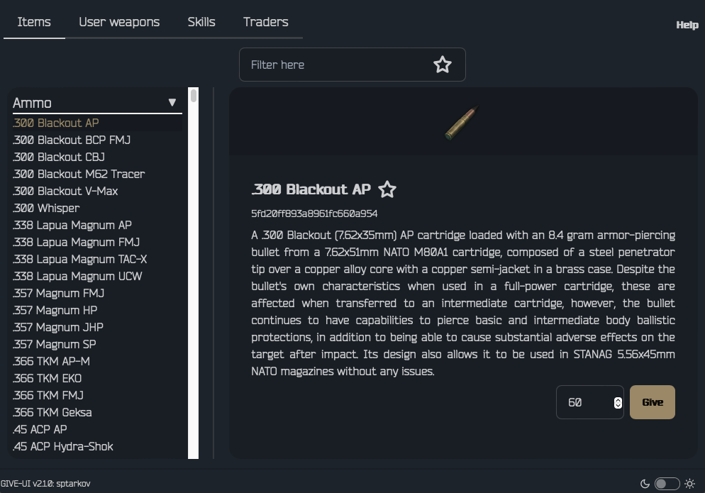
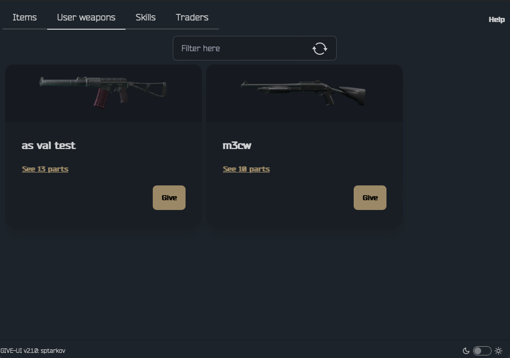
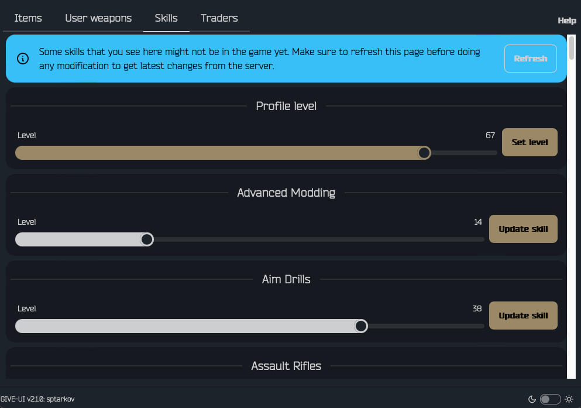
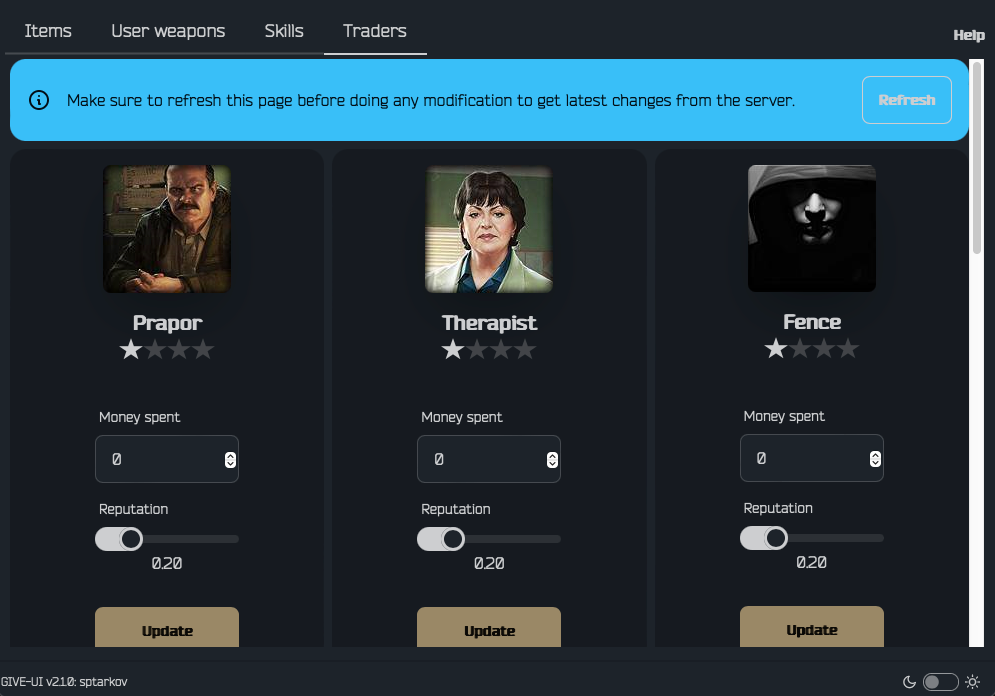

## GIVE-UI

Simple UI for the `SPT GIVE` command.


### How it works

1. With the server and preferably with Tarkov running, open the app
2. Use the form to connect to the server and select your character

### Features

#### Adding items



- Select the item you want to receive. The quantity, by default, is always set to the maximum stack size

#### User weapons presets



- When you have saved weapons presets you can add them to your character with a single click

### Skills



- Update profile level
- Update skills level

### Traders



- Update the reputation of the traders
- Update the money spent on the traders

### Installation
- unzip it in your SPT root folder

### Development

```shell
TEMPL_EXPERIMENT=rawgo templ fmt components/templates.templ && TEMPL_EXPERIMENT=rawgo templ generate && wails dev -devserver 0.0.0.0:34115
```

### Release

- Update version in `wails.json`
- Update version in `server-mod/package.json`
- commit and push (TODO: automate this in future)
- Create a new release with proper tag
- Github action will take over and upload the zip
